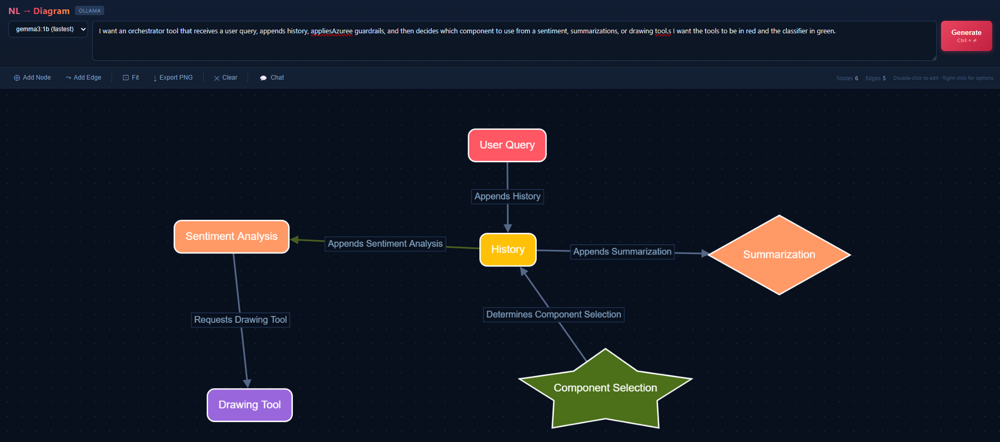

# NL → Diagram

A browser-based app that converts plain English descriptions into interactive, editable diagrams — powered by a locally hosted [Ollama](https://ollama.com) model. No server, no build step, no API keys. Everything runs on your machine.



---

## How it works

1. You type a natural language description of a system or workflow into the text box
2. The app sends your text to a locally running Ollama model
3. The model extracts nodes and edges and returns them as JSON
4. The diagram is rendered interactively using [Cytoscape.js](https://cytoscape.js.org/)

Typos and grammatical errors are corrected automatically by the model before the diagram is generated.

**Example input:**
```
I want an orchestrator that receives a user query, appends history, applies Azure guardrails,
and then decides which component to use from a sentiment, summarization, or drawing tool.
I want the tools to be in red and the classifier in green.
```

---

## Requirements

- A modern browser (Chrome, Firefox, Edge)
- [Ollama](https://ollama.com/download) installed and running
- At least one Ollama model pulled (see recommendations below)

---

## Setup

### 1. Install Ollama
Download and install from [ollama.com/download](https://ollama.com/download).

### 2. Pull a model
Open a terminal and run one of the following. See the model recommendations section below to choose the right one for your hardware.

```bash
ollama pull gemma3:1b       # fastest, ~800MB
ollama pull qwen2.5:3b      # recommended, ~2GB
ollama pull deepseek-r1:8b  # most accurate, ~5GB
```

### 3. Start Ollama with CORS enabled
The browser cannot talk to Ollama unless CORS is explicitly allowed.

**macOS / Linux:**
```bash
OLLAMA_ORIGINS=* ollama serve
```

**Windows (PowerShell):**
```powershell
$env:OLLAMA_ORIGINS="*"; ollama serve
```

**Windows (Command Prompt):**
```cmd
set OLLAMA_ORIGINS=*
ollama serve
```

> If your Ollama models are installed on a different drive, also set the models path:
> ```powershell
> $env:OLLAMA_ORIGINS="*"; $env:OLLAMA_MODELS="D:\Ollama\models"; ollama serve
> ```

### 4. Open the app
Open `index.html` directly in your browser. No web server needed.

Alternatively, serve it with Python:
```bash
python -m http.server
# then open http://localhost:8000
```
---

## Features

### Diagram generation
- Describe any system, workflow, or architecture in plain English
- Typos and spelling mistakes are corrected automatically
- Colors can be specified in the prompt (e.g. "make the tools red")
- Press **Ctrl+Enter** or click **Generate** to run

### Manual editing
| Action | How |
|---|---|
| Move a node | Drag it |
| Edit a label | Double-click the node |
| Change node color | Right-click → Change color |
| Change node shape | Right-click → Change shape |
| Change node size | Right-click → Change size |
| Delete a node | Right-click → Delete, or select + Delete key |
| Delete an edge | Right-click → Delete edge, or select + Delete key |
| Add a node | Toolbar → Add Node |
| Add an edge | Toolbar → Add Edge, then click source and target nodes |
| Pan the canvas | Click and drag on empty space |
| Zoom | Scroll wheel |
| Fit diagram to screen | Toolbar → Fit |

### Toolbar
- **Add Node** — adds a new node at the center of the canvas, immediately ready to rename
- **Add Edge** — enter edge drawing mode; click a source node then a target node
- **Fit** — zooms and pans to fit all nodes on screen
- **Export PNG** — downloads the current diagram as a PNG image
- **Clear** — resets the canvas

### AI chat assistant
Click **Diagram Chat** to open a side panel where you can make changes to the existing diagram using natural language commands:
- `Add a node called Output in blue`
- `Make the Sentiment Tool node red`
- `Rename History to Chat History`
- `Delete the Drawing Tool node`

> **Note:** The chat assistant works best with larger models (8b+). Smaller models like gemma3:1b may produce unreliable results for diagram edits.

### Raw JSON panel
A collapsible panel at the bottom shows the raw JSON of the last generated diagram, useful for debugging.

---

## Architecture

The entire app is a **single `index.html` file** with no dependencies beyond two CDN scripts:
- [Cytoscape.js](https://cytoscape.js.org/) — graph rendering and interactivity
- Ollama REST API at `http://localhost:11434` — LLM inference

All LLM calls go to Ollama's `/api/chat` endpoint. The app:
1. Sends a system prompt instructing the model to return only JSON
2. Strips any `<think>...</think>` reasoning blocks (produced by deepseek-r1 models)
3. Strips any accidental markdown code fences
4. Parses the JSON and renders it with Cytoscape

---

## Troubleshooting

**"Could not reach Ollama at localhost:11434"**
Ollama is not running or was started without `OLLAMA_ORIGINS=*`. Stop Ollama and restart it with the CORS environment variable set (see Setup step 3).

**"Model not found" (HTTP 404)**
The model name in the dropdown doesn't match what's installed. Run `ollama list` in a terminal to see the exact names of your installed models.

**`ollama list` shows nothing**
Your models may be installed in a non-default location. Set `OLLAMA_MODELS` to the correct path when starting Ollama (e.g. `D:\Ollama\models` on Windows).

**"LLM response could not be parsed as JSON"**
The model returned text instead of JSON. This happens most often with very small models (1b). Try retrying, switching to a larger model, or simplifying your prompt.

**Generation is very slow**
If your GPU doesn't have enough VRAM to fit the entire model, Ollama splits inference between GPU and CPU, which is significantly slower. Switch to a smaller model or upgrade to one that fits fully on your GPU.

---

## License

MIT
